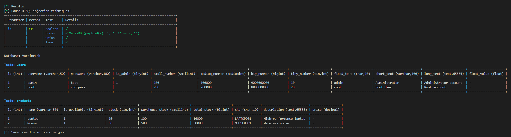

# Vaccine

SQL injection (SQLi) detection and database enumeration tool written in Python.

Vaccine is a command-line tool designed to detect common SQL injection techniques and, where supported, enumerate database metadata and display the resulting database structure.

> **Disclaimer:** Vaccine is intended for authorized security testing, educational labs, and CTF environments. Only use it against systems you own or have explicit permission to test.

---

## Table of Contents

- [Usage](#usage)
  - [View mode](#view-mode)
- [SQL Injection (SQLi)](#sql-injection-sqli)
- [Current limitations](#current-limitations)
- [Architecture](#architecture)
- [Detection workflow](#detection-workflow)
  - [Blind extraction with Boolean and Time-based SQLi](#blind-extraction-with-boolean-and-time-based-sqli)
  - [Numeric value extraction](#numeric-value-extraction)
- [Database enumeration](#database-enumeration)
  - [Data type handling](#data-type-handling)
- [JSON output](#json-output)
- [Testing](#testing)
  - [Local lab](#local-lab)
  - [MSSQL lab](#mssql-lab)
  - [SQLite initialization](#sqlite-initialization)
- [Tester](#tester)
- [SQL Injection reference](#sql-injection-reference)
- [Legal notice](#legal-notice)

---

## TO DO

- Video
- Add to darkly

---

## Usage

Clone the repository and install the project's Python dependencies:

```sh
git clone <repository-url>

cd vaccine

python -m venv venv

. venv/bin/activate

pip install -r requirements.txt
````

Then run the CLI according to the project's entry point.

Usage:

```text
main.py [-h] [-V VIEW] [-X {GET,POST,PATCH,PUT,DELETE}] [-o OUTPUT] [-D] [-A AGENT] [url]

positional arguments:
  url                   Target URL with its parameters. All methods need their data given in the form of valid parameters and values.
                        Example: http://localhost:8080/user.php?id=1

options:
  -h, --help            show this help message and exit
  -V, --view VIEW       View the formatted results with the given result ID
  -X, --method {GET,POST,PATCH,PUT,DELETE}
                        HTTP method
  -o, --output OUTPUT   Output file
  -D, --debug           Enable debug mode
  -A, --agent AGENT     Custom User-Agent
```

### View mode

Vaccine supports a view mode for inspecting previously stored results without running another scan:



Use:

```sh
python main.py -V <result-id>
```

View mode displays the formatted database enumeration results and can be used to inspect the database structure, including:

```text
Database
└── Tables
    └── Columns
        ├── Data type
        ├── Character maximum length
        └── Values
```

This is useful when you only want to inspect the enumerated tables and columns from a previously stored result.

---

## SQL Injection (SQLi)

Example vulnerable query:

```sql
SELECT first_name, last_name
FROM users
WHERE id = <input>;
```

Vaccine supports several SQL injection techniques:

* **Boolean-based SQLi**: injects a true/false condition into the query and infers information from differences in the application's responses.

* **UNION-based SQLi**: uses `UNION SELECT` to retrieve additional data when the original query is compatible with a UNION query.

* **Time-based SQLi**: uses conditional database delays and infers information from differences in response times.

* **Error-based SQLi**: relies on database error messages returned by the application to detect injection and identify the database engine.

---

## Current limitations

* No authentication/login handling.

* Designed for GET, POST, PUT, PATCH, and DELETE parameters.

* Database enumeration currently supports database-engine-specific metadata and extraction logic.

* Enumeration capabilities depend on the privileges available to the database user.

* Time-based detection is sensitive to network and server latency.

* Some database data types are currently unsupported for value extraction, such as floating-point and decimal types.

---

## Architecture

```text
User
 │
 ▼
CLI Parser
 │
 ▼
Injection Engine
 |     │
 |     ├── Error Test ─────┐
 |     |                   | ──▶ Target Analyser (detect context, column count)
 |     ├── Union Test ─────┘
 |     |
 |     ├── Boolean Test
 |     |
 |     └── Time Test
 │
 ▼
Response Analyzer
 │
 ▼
DB Fingerprinter ──┐
 |                 |   Union
 |                 ▼     |
 |          Injection Engine ────▶ Get databases
 |                 |                    |
 |              ┌── ──┐                +-- get tables from information_schema.tables
 |              |     |                |       WHERE table_schema = <that database>
 |           Bool    Time              |
 |                                     +-- get columns from information_schema.columns
 |                                             WHERE table_schema = <that database>
 ▼
Table Display of the Database
 │
 ▼
Storage (JSON)
```

---

## Detection workflow

Vaccine first extracts the parameters supplied to the target endpoint and tests each parameter individually.

For a detected injection point, the tool attempts to determine the SQL context, for example whether the parameter is inserted into a quoted or unquoted expression.

The detected context is then used by subsequent injection tests.

For UNION-based injection, Vaccine determines the number of columns expected by the original query before attempting further enumeration.

When the required injection technique is available, Vaccine can enumerate database metadata using database-engine-specific metadata queries.

### Blind extraction with Boolean and Time-based SQLi

When the application does not directly return the value being queried, Vaccine can infer it one character at a time using blind SQL injection.

For each character, the tool converts the character to its ASCII numeric value and uses a binary search over the printable ASCII range (32 to 126). Instead of testing every possible character, it asks questions such as whether the ASCII value is greater than the current midpoint.

For example, if the character is `A`, its ASCII value is `65`. The search can test progressively smaller ranges:

```text
32 ─────────────────────────────── 126

              │

            > 79 ?  → false

    32 ───────────── 79

              │

            > 55 ?  → true

              │

             ...

              │

              65
```

With **Boolean-based SQLi**, the result of each comparison is inferred from a difference in the HTTP response. A true condition produces one observable response, while a false condition produces another. Binary search uses that true/false result to select the next half of the ASCII range.

With **Time-based SQLi**, the same binary-search algorithm is used, but the true/false result is communicated through response time instead of response content. A condition can trigger a database delay when true and avoid the delay when false. A significantly slower response therefore represents `true`, while a normal response represents `false`.

The process is repeated for every character position until the complete value has been reconstructed.

### Numeric value extraction

For supported integer types, Vaccine can determine numeric values directly using boolean or time-based binary search rather than converting the value to individual characters.

Current integer types include:

```text
TINYINT
SMALLINT
MEDIUMINT / INT
BIGINT
```

depending on the database engine.

Floating-point and decimal types are currently treated as unsupported because reliable value extraction requires additional handling for decimal precision and floating-point representation.

---

## Database enumeration

When database enumeration is possible, Vaccine can retrieve:

```text
Databases
   │
   ├── Tables
   │      │
   │      └── Columns
   │             │
   │             ├── Data type
   │             ├── Character maximum length
   │             └── Values
```

System schemas such as the following are skipped during normal database enumeration:

```text
information_schema
mysql
performance_schema
sys
```

Table and column metadata can be retrieved from:

```sql
information_schema.tables
```

and:

```sql
information_schema.columns
```

The extracted column metadata includes the database's declared data type and, where applicable, its character maximum length.

### Data type handling

Vaccine groups database column types into categories used by the extraction engine.

Example:

```text
STRING
├── CHAR
├── VARCHAR
├── NCHAR
├── NVARCHAR
├── TEXT
└── NTEXT

INTEGER
├── TINYINT
├── SMALLINT
├── MEDIUMINT
├── INT
└── BIGINT

BOOLEAN
└── BOOLEAN / BIT

UNSUPPORTED
├── FLOAT
└── DECIMAL
```

Database engines may expose type names differently. Declared lengths such as:

```text
VARCHAR(50)
CHAR(10)
DECIMAL(10,2)
```

are normalized so that the base data type can be compared against the supported type lists.

For example:

```text
VARCHAR(50)   → VARCHAR
CHAR(10)      → CHAR
DECIMAL(10,2) → DECIMAL
```

Large or legacy text types may require database-specific conversion when determining the actual length of a value.

For example, SQL Server's legacy `TEXT` and `NTEXT` types require conversion to their corresponding `VARCHAR(MAX)` or `NVARCHAR(MAX)` types when certain string-length operations are performed.

---

## JSON output

Results can be stored in JSON for later inspection.

The database dump follows a structure similar to:

```json
{
  "database_name": {
    "table_name": {
      "column_name": {
        "data_type": "varchar",
        "character_maximum_length": 100,
        "values": [
          "admin",
          "root"
        ]
      }
    }
  }
}
```

The stored result can also contain scan metadata such as the target URL and HTTP method.

For example:

```json
{
  "url": "http://localhost:8080/user.php?id=1",
  "method": "GET",
  "results": {
    "database_name": {
      "table_name": {
        "column_name": {
          "data_type": "varchar",
          "character_maximum_length": 100,
          "values": [
            "admin",
            "root"
          ]
        }
      }
    }
  }
}
```

The `-V / --view` option can be used to display a previously stored result without performing a new scan.

---

# Testing

For testing, it is recommended to use intentionally vulnerable applications in an isolated environment.

## Local lab

The project includes an intentionally vulnerable SQL injection lab in [`lab/`](lab/).

The lab contains testing environments for multiple database engines:

```text
lab/
├── MariaDB
├── SQLite
├── MSSQL
└── web application
```

### Default lab

The normal Compose file starts the web application together with the MariaDB and SQLite testing environments:

```sh
cd lab

docker compose up --build
```

The lab is available at:

```text
http://localhost:8080
```

Open `http://localhost:8080/` to access the test page. It provides vulnerable parameters for testing different SQL injection contexts and techniques.

To stop the lab:

```sh
docker compose down
```

The lab is intended for local development and testing. Do not expose it to untrusted networks.

### MSSQL lab

MSSQL is provided through a separate Compose file:

```sh
docker compose -f docker-compose.mssql.yml up --build
```

MSSQL is separated into its own Compose configuration because the Microsoft SQL Server Docker image is significantly larger and takes considerably longer to download.

The MSSQL Compose configuration still includes the other services required by the lab. Therefore, using:

```sh
docker compose -f docker-compose.mssql.yml up --build
```

starts the complete lab environment, including:

```text
Web application
     │
     ├── MariaDB
     │
     ├── SQLite
     │
     └── MSSQL
```

The difference is that this configuration additionally starts SQL Server.

The SQL Server container exposes port `1433`.

The MSSQL initialization container waits for SQL Server to become available and then executes the MSSQL initialization SQL script.

Useful commands:

Check the running containers:

```sh
sudo docker compose -f docker-compose.mssql.yml ps
```

View MSSQL logs:

```sh
sudo docker compose -f docker-compose.mssql.yml logs mssql
```

View the initialization logs:

```sh
sudo docker compose -f docker-compose.mssql.yml logs mssql-init
```

Connect to the MSSQL database from the container:

```sh
sudo docker compose -f docker-compose.mssql.yml exec mssql \
  /opt/mssql-tools18/bin/sqlcmd \
  -S localhost \
  -U sa \
  -P 'VaccineLab123!' \
  -C \
  -d VaccineLab
```

Run a query directly:

```sh
sudo docker compose -f docker-compose.mssql.yml exec mssql \
  /opt/mssql-tools18/bin/sqlcmd \
  -S localhost \
  -U sa \
  -P 'VaccineLab123!' \
  -C \
  -d VaccineLab \
  -Q "SELECT * FROM users"
```

Check the character length of the MSSQL `TEXT` test value:

```sh
sudo docker compose -f docker-compose.mssql.yml exec mssql \
  /opt/mssql-tools18/bin/sqlcmd \
  -S localhost \
  -U sa \
  -P 'VaccineLab123!' \
  -C \
  -d VaccineLab \
  -Q "SELECT LEN(
    CAST(
        (
            SELECT [long_text]
            FROM [VaccineLab].[dbo].[users]
            ORDER BY [id]
            OFFSET 0 ROWS FETCH NEXT 1 ROW ONLY
        )
        AS VARCHAR(MAX)
    )
);"
```

For SQL Server `TEXT` and `NTEXT` values, string functions require an explicit conversion.

For `TEXT`:

```sql
SELECT LEN(
    CAST(
        (
            SELECT [long_text]
            FROM [VaccineLab].[dbo].[users]
            ORDER BY [id]
            OFFSET 0 ROWS FETCH NEXT 1 ROW ONLY
        )
        AS VARCHAR(MAX)
    )
);
```

For `NTEXT`, use `NVARCHAR(MAX)`:

```sql
SELECT LEN(
    CAST(
        (
            SELECT [unicode_long_text]
            FROM [VaccineLab].[dbo].[users]
            ORDER BY [id]
            OFFSET 0 ROWS FETCH NEXT 1 ROW ONLY
        )
        AS NVARCHAR(MAX)
    )
);
```

The MSSQL lab uses the `id` column for deterministic row ordering. Legacy SQL Server `TEXT` and `NTEXT` columns cannot be directly sorted with `ORDER BY`, so they should not be used as the pagination/order column.

Stop the MSSQL lab with:

```sh
sudo docker compose -f docker-compose.mssql.yml down
```

If the lab is intentionally disposable and the database needs to be recreated, remove the relevant database volume/container data before starting it again.

### SQLite initialization

SQLite does not require a separate database container.

The project includes an initialization script:

```text
lab/init-sqlite.php
```

which creates the SQLite test tables and inserts the lab data.

Run it manually with:

```sh
sudo docker compose exec web php /var/www/html/init-sqlite.php
```

The SQLite initialization script can be used to reset the SQLite test database when the existing tables are dropped before initialization.

To inspect the SQLite database schema from the web container:

```sh
sudo docker compose exec web php -r '
require "/var/www/html/config/config-sqlite.php";

foreach ($conn->query("SELECT name, sql FROM sqlite_master WHERE type=\"table\"") as $row) {
    print_r($row);
}
'
```

To inspect the columns of the `users` table:

```sh
sudo docker compose exec web php -r '
require "/var/www/html/config/config-sqlite.php";

foreach ($conn->query("PRAGMA table_info(users)") as $row) {
    echo $row["name"] . PHP_EOL;
}
'
```

To find SQLite database files inside the web container:

```sh
sudo docker compose exec web \
  find /var/www/html -type f \( -name "*.db" -o -name "*.sqlite" -o -name "*.sqlite3" \) -ls
```

If the SQLite database is only being used for testing, the database file can be removed and recreated by running the initialization script again.

---

## Tester

The project also includes a simple Bash script (`test.sh`) for running multiple test targets against Vaccine.

Run it with:

```sh
chmod +x tester.sh

./tester.sh
```

Add or uncomment entries in `TESTS` to test different endpoints and HTTP methods.

---

## SQL Injection reference

The following reference is useful when developing and testing MySQL/MariaDB SQL injection functionality:

[MySQL SQL Injection Cheat Sheet — Pentestmonkey](https://pentestmonkey.net/cheat-sheet/sql-injection/mysql-sql-injection-cheat-sheet)

---

## Legal notice

Vaccine is a security-testing tool. Do not use it against systems without authorization.

The author is not responsible for damage, data loss, service disruption, or unauthorized access resulting from misuse of this software.
